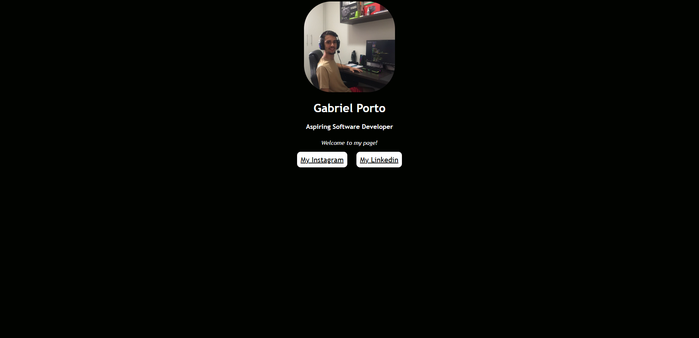

# Projeto Mimo — Web Page Simples

## 📋 Sobre o Projeto

O **Projeto Mimo** é uma página web simples desenvolvida com **HTML e CSS**, criada com o objetivo de praticar as principais tags HTML, explorar estilizações com CSS e direcionar o visitante para minhas redes sociais e perfil online.

Este projeto faz parte da minha jornada de evolução como desenvolvedor — registrando na prática os primeiros passos no desenvolvimento web, versionados com Git e hospedados no GitHub.

## 🚀 Acesse o projeto

🔗 [Clique aqui para acessar o repositório]()

## 📸 Preview

 

## 🛠️ Tecnologias Utilizadas

- **HTML5** — estrutura e semântica da página
- **CSS3** — estilização e layout
- **Git** — controle de versão
- **GitHub** — hospedagem do código

## 📝 Licença

Este projeto é aberto e pode ser utilizado livremente para fins educacionais e pessoais.

## 👨‍💻 Autor

Feito por **Gabriel Porto** — estudante de Ciência da Computação na UNINASSAU

🔗 [Acesse meu GitHub](https://github.com/SEU_USUARIO)

## 📧 Contato

Para dúvidas, sugestões ou reportar problemas, entre em contato ou abra uma **issue** no repositório.

📩 **E-mail:** estudosgabriel07@gmail.com

---